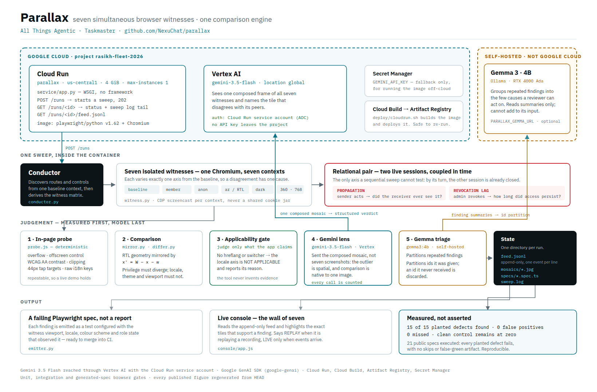

# Parallax

[](https://github.com/NexuChat/parallax/actions/workflows/verify.yml)

The badge is the graded sweep, not just the unit tests: every push runs the
full demo fleet and fails the build on a single missed plant or false positive.

**You give Parallax a URL. It gives you back failing tests.** Nothing in between
is yours to do.

From that one argument it decides everything else on its own: it crawls the
application to find surfaces worth witnessing, decides which comparison axes the
application actually supports and skips the ones it does not, drives seven
isolated browser sessions against the same commit simultaneously, decides which
disagreements between them are defects and which are noise, groups what survives
by cause, and writes each finding out as a Playwright spec you can run in your
own suite. It runs asynchronously on Cloud Run, so a sweep outlives the request
that started it.

The chore it removes is the one nobody automates: opening an app as an owner,
then a member, then in Arabic, then at 360 pixels, then in dark mode — and
trying to remember what the page looked like ten minutes ago.

Parallax is a relational browser regression system. It runs seven isolated contexts together, then turns witness disagreement into failing Playwright specs. The published demo target, `https://demo.mlki.app`, currently reports 17 of 17 planted defects found, 0 missed, and 0 false positives across seven demo applications, while the two clean controls stay at zero.

It also reports revocation lag in an open session: the owner revokes one member while the member’s other live session is still open, and the remaining authority window is measured at 2,572ms. In that run the decision plane passes and the effects plane fails; distribution and enforcement are reported as unmeasured, because a browser witness sees what the member's session could still do, not what the server sent or refused. The finding says so in those words rather than counting an unobserved plane as a passing one.



The diagram above is the whole system on one page: what runs on Google Cloud,
how Gemini is reached, where state lives, and what a run leaves behind. Its
source is [`docs/architecture-diagram.html`](docs/architecture-diagram.html), and
[`docs/ARCHITECTURE.md`](docs/ARCHITECTURE.md) is the prose version.

## What is already solved, and what is not

Visual regression is a settled field. Percy, Chromatic, Applitools, and
BackstopJS all compare one run of a page against an earlier run of the same
page, and they do it well; Playwright ships `toHaveScreenshot` for the same
purpose. Their axis is time, and their oracle is a stored baseline, so they
answer "did this page change since yesterday" and need a human to say whether
the change was intended. Accessibility scanners such as axe-core and Lighthouse
take the other approach — a fixed rule set applied to one rendering, with no
baseline needed and no notion of a second observer.

Parallax's axis is not time and its oracle is not a stored image. Seven
contexts render the same commit of the same page concurrently, each differing
from the baseline by exactly one property, and the finding is the disagreement
between them. That needs no golden file, so it works on the first run against a
site nobody has swept before, and it reports a class of defect a time-diff
cannot express: a surface an anonymous witness reaches that it should not, a
translation whose meaning drifted from the source, an owner action a member's
live session never receives. The last of those needs two simultaneous
authenticated sessions, which single-session snapshot tooling has no way to
hold open.

## Quickstart

Parallax requires Python 3.12+, Chromium for Playwright, and its runtime packages. From the repository root, install into a virtual environment:

```bash
python3 -m venv .venv
.venv/bin/python -m pip install .
.venv/bin/python -m playwright install chromium
```

The virtual environment is not a style preference. Debian, Ubuntu, and Homebrew
mark their system Python as externally managed under PEP 668, so a bare
`pip install .` there fails with `externally-managed-environment` before it
installs anything. Installing the package brings in Playwright, Pillow,
`google-genai`, and the direct `google-auth` dependency used by the Vertex
route; the last command downloads the browser build Playwright drives.

Installing the package puts `parallax` on the PATH. Three commands:

```bash
parallax init          # write a parallax.toml to start from
parallax doctor        # check a sweep can run here, before one spends four minutes finding out
parallax sweep         # witness the application and emit failing specs
```

`parallax.toml` holds the settings that belong to a project — the target, where
evidence is written, which models are configured — so a sweep is a command
rather than eight arguments retyped from shell history. Any of them can still be
given as a flag, and a flag always wins, because the reason to type one is to
override what is written down. Secrets are the exception and are never written
there: the file says where credentials live, not what they are.

`parallax doctor` reports what is configured and what is missing without running
anything, and only a broken Chromium or an unusable target stops a sweep —
everything else degrades and says so:

```
ok    configuration   /work/parallax.toml
ok    chromium        151.0.7922.34
ok    vertex ai       project rasikh-fleet-2026
ok    credentials     /work/.auth/credentials.json (mode 600)
note  finding triage  no PARALLAX_GEMMA_URL; grouping is disabled
```

The module form is unchanged and takes the same flags. `PYTHONPATH=src` runs the
checkout's own code rather than the installed copy; `--no-vision` makes the run
independent of a Gemini API key.

```bash
PYTHONPATH=src .venv/bin/python -m parallax https://app.example.com --out runs/first --no-vision
```

### Finding the way in by itself

Handing Parallax two storage-state files is a long way from "point it at a URL".
Give it credentials instead and it finds the sign-in surface, the fields on it,
and the way in:

```bash
PYTHONPATH=src .venv/bin/python -m parallax https://app.example.com \
  --out runs/first --credentials .auth/credentials.json
```

```json
{
  "credentials": {
    "owner":  {"identifier": "owner@example.com",  "secret": "…"},
    "member": {"identifier": "member@example.com", "secret": "…"}
  }
}
```

A file rather than an argument, because a secret passed on the command line is
visible in `ps` to every user on the machine and lands in shell history. The
secret is read once and never reaches a report, a feed event, or a generated
spec — `Credential` will not even render it in a traceback.

Nothing about the sign-in is declared. Links the page itself offers are ranked
ahead of the usual paths, in English and Arabic alike, and the panel is located
by its password field rather than by a `<form>` element — the first real
application this met renders a sign-in panel with no form at all, and had three
plausible buttons beside it, of which `دخول كزائر` and `إنشاء حساب` do not use
the credentials you supplied. A session is only claimed when the password prompt
is gone or a way out has appeared; submitting a form and hoping is not a
sign-in.

The same pass then establishes **how the application changes language**, because
that is not something to assume either. `?lang=ar` counts only if the document's
`lang` attribute actually changes; otherwise a real language control is located
— including inside a signed-in user's settings, which is where most applications
keep it — actuated, and confirmed. The run reports which mechanism it found:

```
sign-in owner: succeeded via http://…/login
sign-in member: succeeded via http://…/login
locale mechanism: query — the lang attribute changes for ?lang=ar
```

With credentials alone and nothing else declared, a sweep of the bundled
workspace demo exercises all four axes; without them the privilege axis reports
itself as not applicable rather than guessing.

To skip discovery and supply Playwright storage-state files directly, which
takes precedence over anything discovered:

```bash
PYTHONPATH=src .venv/bin/python -m parallax https://app.example.com --out runs/first --storage-state owner=.auth/owner.json --storage-state member=.auth/member.json --no-vision
```

To test a sender-to-receiver claim while both role sessions are open, add `--relational-scenarios` with a data-only JSON file. It supports a fixed form submission action and either a visible receiver selector or a JSON response membership check—no JavaScript from the file is evaluated. For example, save this complete file as `scenarios.json`:

```json
{
  "scenarios": [
    {
      "surface": "/threads",
      "sender": "owner",
      "receiver": "member",
      "action": {
        "type": "submit_form",
        "form": "form.composer",
        "checks": ["input[value='quiet']"],
        "fills": [{"selector": "#message", "value": "Parallax propagation check"}]
      },
      "effect": {
        "type": "json_contains",
        "url": "api/messages?since=0",
        "items": "messages",
        "field": "text",
        "equals": "Parallax propagation check"
      },
      "deadline_ms": 3000
    }
  ]
}
```

Run it with the same role states: `PYTHONPATH=src .venv/bin/python -m parallax https://app.example.com --storage-state owner=.auth/owner.json --storage-state member=.auth/member.json --relational-scenarios scenarios.json --no-vision`. Each scenario needs `surface`, `sender`, `receiver`, `action`, `effect`, and a positive `deadline_ms`; roles are `anon`, `member`, or `owner`. A `visible` effect is `{ "type": "visible", "selector": ".notification" }`. A revocation scenario also needs `"type": "revocation"` and a non-negative `max_lag_ms` below `deadline_ms`. The former is the authority-loss contract; the latter is only how long Parallax may observe before declaring that authority never ceased. The final JSON summary reports both `relational_scenarios.ran` and `relational_scenarios.findings`.

Demo sites can opt in without suite-specific code: declare a `relational_scenarios` list beside `accounts` and `planted`, with entries in this same format. Their `surface` may be the site-local path such as `/threads`; the suite mounts it below the site's name before passing it to the conductor.

`--propose-scenarios` asks Gemini 3.7 Flash on Vertex AI for up to three relational scenarios after baseline discovery. It receives only routes, visible affordances and their labels and selectors, observed same-origin endpoints, visible text, and the roles supplied to the run. The flag is off by default, so an existing command never gains a model call or a scenario. Run it alongside the role states, for example: `PYTHONPATH=src .venv/bin/python -m parallax https://app.example.com --storage-state owner=.auth/owner.json --storage-state member=.auth/member.json --propose-scenarios --no-vision`.

A proposal is never an instruction. Before the existing data-only scenario validator can accept it, Parallax rejects any proposal that names an unobserved route, selector, endpoint, or role, or that falls outside the restricted relational grammar. Each survivor then passes through the same validator as a JSON declaration; no proposal can supply JavaScript or a new action type. The final `proposal` summary records how many scenarios Gemini proposed and validated, each rejection and its reason, route, call counts, and any error.

A published run shows the whole loop:
[`console/runs/workspace-proposed`](console/runs/workspace-proposed/feed.jsonl)
was produced by a sweep given nothing but a URL and two role sessions. Gemini
proposed two relational scenarios; the guard rejected one because
`effect.selector 'main.auth > form:nth-of-type(1)' was not observed`; the
survivor was replayed against two live sessions and produced a `propagation`
finding. The summary reports `"ran": 1, "declared": 0, "proposed_by_model": 1`,
so a scenario the model invented is never counted as one a human declared.

The rejection reason is worth reading, because it is the interesting half. The
model does not get to widen its own input: it may only name routes, selectors,
endpoints, and roles the baseline crawl actually observed. Early live runs were
rejected for a different reason — the model kept inventing effect keys like
`effect.text` — which was a prompt that elided the grammar rather than stating
it. With both effect shapes spelled out exactly as the validator enforces them,
format rejections stopped and only evidence-grounding rejections remain.

Open `console/index.html?feed=../runs/first/feed.jsonl` in the repository's console, or use the live console. The demo film is on YouTube: [https://youtu.be/D2dLCLVAZ2A](https://youtu.be/D2dLCLVAZ2A). It is served by one Cloud Run service in
`us-central1`, reachable at its own Google URL —
[`parallax-x6nwdmf3oa-uc.a.run.app`](https://parallax-x6nwdmf3oa-uc.a.run.app/console)
— and at [`perallax.mlki.app`](https://perallax.mlki.app), which is the same
service behind a friendlier name. The `.run.app` address is given first because
the Cloudflare-fronted one shows no evidence of where it runs. The local console reads the newline-delimited feed and its referenced mosaics; serving the repository with a static web server avoids browser `file:` restrictions.

The command also accepts `--max-surfaces`, `--settle-ms`, and `--headed`. Omit `--no-vision` to enable the Gemini layout and i18n lens. It chooses the first available route: a configured Vertex AI project (`GOOGLE_CLOUD_PROJECT`, with optional `GOOGLE_CLOUD_LOCATION`, defaulting to `global`) using application-default credentials or a fresh `gcloud auth print-access-token` bearer token; then `GEMINI_API_KEY` for AI Studio. The CLI prints the selected route, or explains why the lens is disabled, before the sweep starts.

## What a run produces

Everything for one run is written below `--out`:

- `feed.jsonl` is the append-only event feed consumed by the console.
- `mosaics/` contains JPEG walls for settled visual moments, and — for every
  surface that actually moved — an animated `-motion.webp` of the same wall in
  motion: the CDP screencast each witness records, retained and composed once
  instead of discarded after the settle gate used it.
- `specs/` contains one generated failing Playwright `.spec.ts` per finding that
  can be expressed as a check. A render finding from the vision lens has no
  measured defect behind it — the model said one tile disagreed with its peers,
  which is a judgement rather than a geometry — so no spec is written for it.
  Writing one anyway produced a file that threw unconditionally, failing against
  a healthy application exactly as loudly as against a broken one, and a test
  that cannot pass is not a test of the application.
- The command prints totals for discovered surfaces, testimonies, findings, severity counts, feed path, and generated specs.

The console reads `feed.jsonl` and replays it. A sweep captures a settled wall
for every moment it observed — thirteen to forty of them on the published runs —
and a completed feed arrives in one read, so the frames are played back with a
scrubber rather than collapsed into whichever one happened to be last. Selecting
a finding pins its evidence frame and stops the playback.

Seven contexts side by side means each witness is a seventh of the panel, which
is too small to read the control a finding is about. Clicking a tile opens that
witness across the viewport, outlined with everything else dimmed, and the arrow
keys walk the wall so two witnesses of the same moment can be compared. The wall
is stored at tile scale on purpose — it is re-encoded on every moment and sent to
the vision model — so the inspector says it enlarges rather than claiming pixels
that were never captured.

Authenticated specs never embed the storage-state path used by the sweep. Set
`PARALLAX_OWNER_STORAGE_STATE` or `PARALLAX_MEMBER_STORAGE_STATE` to a
CI-provisioned state file for that role; a spec that needs one fails with a clear
message when the variable is absent. The bundled demo grader creates its role
states in a private `0600` temporary directory and removes them in `finally`, so
cookies never enter `runs/` or the public console artifacts.

## Reading a finding

A finding identifies a surface, the axis under test, a severity, a short summary, and its supporting testimonies. The evidence line lists each witness context and outcome, for example `owner-en-light-desktop=reached · owner-ar-light-desktop=blocked`. `render` findings come from an observed defect such as overflow or contrast; `drift` means a non-privilege context changed reachability; `escalation` and `inversion` describe unexpected privilege results; `divergence` marks changed content; `propagation` is a missed sender-to-receiver update; and `dead` means no usable testimony reached the surface.

## The seven contexts

Parallax starts with `owner-en-light-desktop` and changes exactly one axis at a time:

| Context | Changed axis |
| --- | --- |
| `owner-en-light-desktop` | baseline |
| `member-en-light-desktop` | privilege |
| `anon-en-light-desktop` | privilege |
| `owner-ar-light-desktop` | locale |
| `owner-en-dark-desktop` | theme |
| `owner-en-light-mobile` | viewport, 360 × 740 |
| `owner-en-light-tablet` | viewport, 768 × 1024 |

There are two expectations. Privilege is the exception: access should narrow as privilege falls, so an anonymous or member witness reaching a surface that the owner also reaches is reported as an escalation. Locale, theme, and viewport are equivalence axes: changing one must not change what the user can reach; theme and viewport are also checked for unexpected content changes. The locale comparison additionally checks that geometry is mirrored for right-to-left rendering, while the theme comparison requires unchanged layout geometry.

## Semantic content and translation checks

A content-signature mismatch is a reason to inspect a changed region, not by itself proof of a defect. The FNV-1a signature still identifies changed content, but it no longer decides ordinary content divergence alone. For theme and viewport comparisons, Parallax sends only the changed visible landmark text to Vertex AI's `gemini-embedding-001` model and compares the vectors by cosine similarity. A score of at least `0.90` is equivalent; a lower score becomes a content-divergence finding. The finding keeps the model name, score, and threshold as evidence, so a reviewer can see why a hash mismatch was or was not treated as material.

For locale, Parallax translates the baseline region with Cloud Translation v2 and
compares the two same-language strings by embedding. Both directions are
reported, and they are different defects.

An **untranslated** page shows the baseline's own text, so it scores as
*equivalent* — the one verdict that would clear it if the score were trusted
alone. The deterministic raw-text check decides that case and the score only
corroborates it.

A **mistranslated** page is the defect no deterministic check can see: the script
is right, the strings are different, and nothing is missing. Reporting it needs a
model that can separate a correct translation from an unrelated one, and the
choice of model is the whole reason it can be claimed. Measured on eight
translate-then-compare pairs, four correct and four deliberately mismatched:

| model | correct translations | wrong translations | gap |
| --- | --- | --- | --- |
| `text-embedding-005` | 0.996 – 1.000 | 0.978 – 0.998 | **−0.002** |
| `gemini-embedding-001` | 0.970 – 0.987 | 0.702 – 0.836 | **+0.134** |

The bands overlap for the first, so no threshold separates them and the claim was
withdrawn rather than left standing on a number that did not exist. The second
separates them cleanly, and `0.90` sits inside the measured gap rather than being
chosen by intuition. The `SEMANTIC_SIMILARITY` task type is not decoration:
without it the model returns a general-purpose vector and the separation
collapses.

This path is bounded deliberately. Regions with matching content signatures are never sent; each sweep compares at most twelve changed regions, batched into at most one translation request and one embedding request. That is at most two paid semantic-model calls regardless of the number of visited surfaces. The JSON `semantics` report records attempted and successful calls and errors for both services. If embeddings fail, theme and viewport findings fall back to the content-signature mismatch and say that the comparison degraded. A locale comparison that cannot be translated or embedded is also reported as degraded; it produces a locale finding only if the deterministic untranslated check has evidence.

## What a role can do, not just what it can see

Every other check here asks what a role can *see*. A capability scenario asks
what a role can *do*, and then measures what the doing produced. The two come
apart in the case that matters most: a control hidden with CSS in front of an
endpoint that still accepts the request is not a visibility bug, it is an
authorisation bug, and a witness that only reads the rendered page calls that
surface clean.

Declare one beside `scenarios` in the same file, using the same validated
action grammar:

```json
{
  "capabilities": [
    {
      "label": "post a message to a thread",
      "surface": "/workspace/threads",
      "roles": ["owner", "member", "anon"],
      "allowed": ["owner", "member"],
      "action": {"type": "submit_form", "form": "form.composer",
                 "fills": [{"selector": "#message", "value": "check"}]},
      "effect": {"type": "json_contains", "url": "api/messages?since=0",
                 "items": "messages", "field": "text", "equals": "check"},
      "deadline_ms": 4000
    }
  ]
}
```

The action is replayed once per role on its own session. A role outside
`allowed` that completes it is an **escalation** — the control being hidden did
not stop the action. A role inside `allowed` that cannot complete it is a
**capability drift**: the feature is broken for someone who holds it. Both were
exercised live against the bundled demo; pointing the same declaration at the
workspace demo's deliberately broken quiet thread reports
`owner holds 'post a message to a thread' … but the action did not take effect
within 4000ms`, and pointing it at the working thread reports nothing.

Then the state the action produced is measured. This is the part no snapshot
tool reaches: a dialog, a drawer, a confirmation panel is on no freshly loaded
page, so a checker that measures page load never measures it at all. The same
probe that finds overflow, contrast, tap-target and mirroring defects on a page
runs again on whatever the action put on screen, and the finding says
`measured after the action, not at page load`.

Nothing is discovered and clicked. The action is declared in the validated
grammar, or proposed by Gemini and filtered by the observed-evidence guard;
Parallax never invents an action to perform.

**A capability check mutates the application under test.** That is not a caveat,
it is the point — an action that changed nothing proves nothing — but it has a
cost that was measured here rather than imagined: exercising the demo fleet's
composer left real messages in its threads, which changed the page content and
made the next graded sweep report three findings nobody planted. Point
capability scenarios at an environment you are willing to have written to, and
reset it between graded runs.

## An order, not a moment

Everything above asks one question about one instant: somebody acts, and the
others are checked for the effect. A great deal of what an application promises
is not an instant but a sequence. An invitation must arrive before it can be
accepted. A turn belongs to one player and must be refused from the other. A
game's ending is not a private fact.

Testing a sequence as a list of independent effects hides the failures that
matter. If step four is wrong, checking only the final state reports that
somebody won and says nothing about the illegal move that got them there. So a
choreography verifies every step from every participant *before* the next step
is allowed to run, and stops at the first divergence — because in a protocol the
first divergence is the cause and everything after it is consequence.

```json
{
  "choreographies": [{
    "label": "invite, play, and win",
    "surface": "/arena/game",
    "participants": [
      {"name": "amira", "surface": "/arena/game?me=amira&vs=samir"},
      {"name": "samir", "surface": "/arena/game?me=samir&vs=amira"}
    ],
    "steps": [
      {"label": "amira invites samir", "actor": "amira",
       "action": {"type": "click", "selector": "#send-invite"},
       "expect": [
         {"participant": "samir", "effect": {"type": "visible", "selector": "#accept"}},
         {"participant": "amira", "effect": {"type": "visible", "selector": "#accept"},
          "visible": false, "note": "an invitation everybody can see is not an invitation"}
       ]}
    ]
  }]
}
```

The demo fleet serves the same tic-tac-toe game at two routes. `/arena/game`
plays correctly and plants nothing. `/arena/game-legacy` reports the win to the
winner and keeps telling the loser that play continues and the turn is theirs.
Both routes screenshot identically. The graded sweep plays the seven-step
protocol and reports:

```
'invite, play, and win' broke at step 7 of 7, 'amira completes the middle row
and wins': samir should have seen it but it never appeared — and so is the
player who lost
```

Every participant is a real session opened before the first step, for the same
reason an audience is: a player who joined after the invitation was sent cannot
testify about whether the invitation arrived.

## One event, several vantage points

A capability repeats an action as several roles and asks who may perform it. An
audience performs it *once* and asks who perceived it — every observer already
watching when it happens, and each carrying its own expectation, including a
negative one. "Nobody outside the room heard it" is a claim that can only be
made by watching the people who should not have.

The call room is a real WebRTC mesh: audio genuinely travels between browser
sessions through Chromium's synthetic microphone. `/call/room` enforces its own
mute. `/call/room-legacy` updates the control, sets the label to `mic-off`, and
never touches the outgoing track — the "you are still unmuted" bug. The two
routes are pixel-identical, so no screenshot tool can tell them apart. The
graded sweep mutes and asks three sessions what they can hear:

```
samir perceived 'muting stops the audio the others receive' but is not an
intended audience for it — the event reached samir, layla
```

The third observer turned their own speaker off and is correctly *not* reported.
That distinction is the whole reason the sensor measures energy through an
`AnalyserNode` rather than asking whether a track exists: a muted sender, a
deafened listener and a working call all have tracks.

## Hearing and seeing, not only reading the page

An effect does not have to be in the DOM. A participant who can hear leaves no
mark on the page, and a participant who has muted looks identical to one who is
listening — so "did B hear A speak" is unanswerable by every check above it,
while being exactly the same *shape* of question as "did B see A's message": one
actor, several simultaneous observers, each with its own expectation.

Two effect kinds close that gap, declarable anywhere the others are:

```json
{"type": "audio_received", "min_level": 0.01, "min_packets": 5}
{"type": "audio_audible",  "min_level": 0.01}
{"type": "video_received", "min_frames": 5}
```

`audio_received` and `audio_audible` are deliberately separate, because they are
different questions and a call needs both. The first asks whether the signal
arrived — transport, negotiation, the sender's microphone. The second asks
whether this participant would actually hear it, which a receiver can refuse by
muting its own playback while everything upstream keeps working. Conflating them
would report a mute that works correctly as a propagation failure.

A page's `RTCPeerConnection` objects are not reachable from outside unless the
application chose to expose them, and none does, so the constructor is wrapped
before any application script runs and every connection registers itself. That
instrumentation records; it never alters what is negotiated, sent, or received.

**Presence is not perception, and this is the measurement that matters.** A
muted participant still negotiates, still has a track, and still receives
packets. Measured live on a two-peer call, speaking reported an audio level of
`1.0254` and muted reported `0.0000` — while `packetsReceived` was `175` and
`174`. Packet counting cannot tell the two apart. Energy can, read from the
received signal with the Web Audio API and from `getStats`, whichever is louder.
An element's `volume` is never consulted: it is what a page was told to play at,
not what arrived.

A session that is supposed to speak needs a microphone that produces sound, or
it is indistinguishable from a muted one; `speaking_args()` supplies Chromium's
synthetic device and, optionally, a recording to play into it.

The bundled [`call`](demo/sites/callroom.py) demo is a real WebRTC mesh rather
than a simulation, because a fixture that faked the audio would prove only that
the fake worked. Eight simultaneous sessions, twenty-eight peer connections, and
every state the question turns on:

| participant | signal arrived | would hear it |
| --- | --- | --- |
| three speakers | yes | yes |
| microphone off | yes | yes — muting your own microphone does not deafen you |
| in the call, listening | yes | yes |
| in the room, not in the call | yes | yes — listening in is what a room is for |
| in the room, speaker off | **yes** | **no** — by choice, and not a defect |
| joined late | yes | yes |

Two measurements from that run are the whole argument. With the sender's
microphone off, the listener measured level `0.0000` while `packetsReceived`
climbed to `567` — packet counting cannot tell a muted participant from a
speaking one. With the listener's speaker off, the received signal measured
`1.0282` and the audible signal `0.0000` — the audio arrived perfectly and the
participant still heard nothing.

So a group call is expressible as an audience scenario without any new
machinery: the speaker is the actor, participants expect `audio_audible`, and
whoever muted or is outside the room carries the same expectation negated.

## Which findings become specs

Not all of them, and the gap is stated rather than papered over. A finding
becomes a Playwright spec when the emitter can write an assertion about the
application from it. Render, privilege, locale, theme and viewport findings all
carry a measured geometry or a reachability claim, and so does a declared
relational scenario, because the declaration is retained and replayed.

The two multi-session judgements do not. A protocol that broke at step seven and
an audience that heard audio it should not have are claims about several live
sessions in one moment, and this emitter writes a single-page spec. Asked to
express the audience finding anyway it reached for the privilege template and
produced a check for a login redirect — a file that would fail against an
application whose audio leak had been fixed, for a reason that had nothing to do
with audio. It now declines, and the release gate is the proof: every one of the
18 generated specs fails as an assertion, with none skipped and none passing.

The findings are still reported, still published, and still graded. What is
missing is the generated regression test for them, and that is an emitter that
cannot yet write multi-context specs rather than a finding anybody should trust
less.

## A limit the axis gate does not cover

The applicability gate drops findings on an axis the application does not
support, and it decides that per axis. A specialist finding carries the axis of
the witness pair it compared, not the axis of the thing it describes — so the
vision lens observing "this interface is Arabic where an English locale was
requested" is filed under theme, or privilege, or viewport, depending on which
pair happened to surface it, and the locale gate never sees it.

On the published `arbchat` sweep that is twenty findings which are one
observation repeated. They are real observations about a monolingual
application, and the locale axis on that same run correctly reports itself not
applicable — which is the contradiction. The fix is for a specialist to name the
axis it is talking about instead of inheriting the one it was called on, and
that is not done.

## Limits

Parallax observes rendered surfaces and discovered controls; it does not prove application policy, API authorization, or behavior outside the exercised browser flow. It uses the role storage states you supply, so a missing or incorrect role state limits what its privilege witnesses can establish. Evidence is tiered on purpose. Anything a page can be measured for — overflow, contrast ratio, mirrored geometry, tap-target size — is decided by the in-page probe, because a measurement is repeatable and a model's opinion is not; that is what makes a live unedited run reproducible. Gemini 3.7 Flash is given the one question geometry cannot express: shown all seven witness tiles composed into a single frame, which tile disagrees with its peers. Its verdicts are accepted only when they name a real tile, and they are labelled with their source in the feed. Running with `--no-vision` therefore removes cross-tile visual comparison and leaves every measured check intact.

## Revocation lag

Every organisation can say when it revoked a permission. None can say when access
actually stopped. OWASP ASVS V3 requires that all active sessions be revoked when
an account is disabled, the OWASP testing guide describes checking that by hand,
and no automated verifier exists; Microsoft's own continuous-access documentation
admits propagation latency of up to fifteen minutes and leaves the last mile to
the application.

Parallax measures that last mile. An owner revokes a member in one live session
while the member's already-open session is held open in another, and the sweep
reports how many milliseconds the open session kept working. This cannot be done
sequentially: run the roles one after another and the already-open session — the
entire subject of the test — is gone before the second role starts.

The result names which of four planes it is talking about, because they fail
independently: the revoke is **recorded** (decision), it **propagates** to the
backend (distribution), a **new** request is refused (enforcement), and the
session already open stops reading (effects). That last plane is the one nobody
measures, and the bundled workspace demo plants exactly that failure, a
per-session membership cache re-read on a delay:

```
REVOCATION · HIGH
Revocation authority ceased after 2,572ms (acceptable <= 100ms); failed plane:
effects; unmeasured plane: distribution, enforcement
```

The second clause is as important as the first. A browser witness observes what
the revoked session could still do; it does not see what the server recorded
internally or what it would have said to a fresh request. Reporting distribution
and enforcement as *unmeasured* rather than passing keeps the finding to what a
browser can actually establish — and makes the failing plane the one the
evidence supports.

Authority is not what a rendered page still shows — markup survives revocation
indefinitely — so the assertion has to be a live request from the open session.
Declare one the same way as any other relational scenario, with `"type":
"revocation"`.

## Axis applicability

An axis is judged only where the application shows evidence of claiming it: a
localized alternate or language switcher for locale, a `prefers-color-scheme`
query or theme toggle for theme, a viewport meta for viewport, supplied role
states for privilege. Anything else is reported as not applicable, with the
reason, and produces no findings.

This is a correctness rule, not a convenience. Forcing `dir="rtl"` onto an
application with no Arabic support and then reporting it for not mirroring is the
tool inventing its own evidence. Every run prints what it did not test:

```
"axis_summary": "1 axes exercised, 3 not applicable"
```

## Grouping the noise

An early pre-calibration sweep of the demo fleet produced 94 false positives.
Because every demo site declares its intentional defects, that was measurable
rather than subjective: it exposed page-wide measurements repeated on controls,
unstable query variants, and fixture accessibility defects. The current graded
gate reports **17 of 17 planted defects found, 0 missed, and 0 false positives**,
including on the clean control. Real applications can still produce many
legitimate findings, so grouping remains useful after detection rather than as a
way to hide detector noise.

Grouping them is a judgement about wording, not a measurement, which is the one
place a small model earns its place here. **Gemma 4** reads only the summaries
the deterministic layers already produced and returns a partition of their ids:

This is the grouping it produced on the third-party sweep below, taken from the
`triage` event in [that published feed](console/runs/the-internet/feed.jsonl)
rather than retyped here:

```
19 findings grouped into 3 causes by gemma3:4b   # this published run predates the Vertex route
  14  Text contrast and tap target size issues
   3  Horizontal overflow and tap target size issues
   2  Viewport differences
```

It cannot invent a finding, change a severity, or reach a page. An id it returns
that was not in its input is discarded, and a finding is claimed by one group
only — both checkable against that feed, since the event carries the finding ids
and every id in it also appears as a `finding` event in the same file.

Two routes serve it. By default **Gemma 4 on Vertex AI**
(`gemma-4-26b-a4b-it-maas`), through the same project, credentials and transport
as the embedding lens — so a reader with the project reproduces the grouping
without installing anything. That model is served only from the *global*
endpoint; asking a region for it answers `only available via global endpoint`
rather than 404, which is worth knowing because a 404 sends you looking for the
wrong thing entirely. Setting `PARALLAX_GEMMA_URL` to an Ollama-compatible
endpoint overrides that, because an operator who set one meant it.

With neither, the run names both routes rather than saying only that grouping is
off, and an unreachable grouper is reported as unreachable rather than as a run
that found nothing to group.

Self-hosting remains worth keeping as an option rather than a fallback. The
finding summaries describe defects in someone's application, and an operator who
would rather they never left the machine can point `PARALLAX_GEMMA_URL` at a
local Gemma and get the same grouping with the same guards. The measurements go
to Google Cloud either way; where the opinion about wording is formed is the
operator's decision, and both answers are one environment variable apart.

## The declaration surface

Everything a user tells Parallax lives in one reviewable place: `parallax.toml`
beside the project, plus the data-only scenario file it points at. The design
rule is **default-everything, declare-to-override** — with no file at all, a
sweep discovers the routes, signs in if given credentials, and the axis gate
decides which comparisons the application even supports. Declarations narrow or
extend that; they never have to exist for the first sweep to say something.

What is declarable today:

| Concern | Where | What it does |
|---|---|---|
| Target, output, crawl budget | `[target]` | which app, where evidence goes, how far to look |
| Roles and their credentials | `[auth]` | Parallax finds the sign-in surface itself |
| Models on and off | `[models]` | vision lens, proposer, triage — each reports itself disabled rather than silently missing |
| Application promises | `[scenarios] file` | relational, capability, audience and choreography declarations — a message that must arrive, a role that must be refused, a call that must go quiet, a game that must end for both players |
| Hard limits | `[constraints] deny` | routes and controls the agent must never visit or press — `"delete"` covers every delete button, `/admin/*` covers a subtree; every exclusion is recorded in the feed as `denied`, so an audit sees what was not swept and why |
| Delivery | `[delivery]` | open the pull request, and against which branch |

What is deliberately **not** declarable: cross-product combinations. The seven
witnesses each differ from the baseline by exactly one property, so a
disagreement has exactly one candidate cause. A configuration that produced
`arabic × dark × mobile` witnesses would destroy that diagnosis, and no schema
option will be added that quietly does so — widening an axis means more
one-axis witnesses, never deeper ones.

Three extensions are designed and not yet built, and are listed here rather than
implied: per-axis value lists (which locales, which viewports, which browser
engines — each still varied alone); declared brand tokens (the project's own
fonts and colours as measurable expectations, which is the honest version of a
"design standard" — a declared rule, not a model's taste); and a temporal lens.
Each witness's CDP screencast is now retained and published as a motion clip
per moving surface — and Gemini accepts video natively, so those clips are
exactly the evidence a model could judge hover states, scroll behaviour and
animation jank against. The footage ships; the lens that watches it does not
yet.

## Reproducing the published figures

The figures on the front page come from a graded sweep of five bundled demo
applications that declare their own deliberate defects in code, including a
clean control with nothing planted. The suite grades Parallax against those
declarations, so a false positive is measured rather than asserted.

It needs the demo fleet already listening; it does not start one:

```bash
PORT=8080 PYTHONPATH=src:demo:. .venv/bin/python demo/serve.py &
PYTHONPATH=src:demo:. .venv/bin/python scripts/run_demo_suite.py \
  --no-vision --host http://127.0.0.1:8080 --no-publish
```

It exits non-zero for any miss or false positive. The current reproducible
result is **17 of 17 planted defects found, 0 missed, and 0 false positives**;
the clean control also stays at zero. `--no-publish` grades without touching the
published evidence, which is what the CI gate in
[`.github/workflows/verify.yml`](.github/workflows/verify.yml) runs on every
push. Drop the flag to regenerate the artifacts instead: without it the run
rewrites `web/graded-summary.json`, replaces the sweeps under `runs/`, and
publishes a no-follow artifact manifest under `console/runs/`. Public specs
contain no local storage path, role cookie, or skipped test.

If the suite reports every surface dead and logins failing with HTTP 401, the
demo fleet is not running on the host passed to `--host`.

The demo serves its own webfonts, which is what makes the figure portable. The
sites originally asked for `Georgia`, `system-ui` and `ui-monospace`, none of
which is installed everywhere, so each host resolved a different fallback with
different text metrics — and a measurement like horizontal overflow or
tap-target size is exactly the kind that moves across a threshold when metrics
shift. This is not hypothetical: the same commit that graded a clean sweep here
reported two unplanted render findings on a GitHub runner, and twenty under a
Liberation-only font set. The fleet now serves subset faces built by
[`scripts/build_demo_fonts.py`](scripts/build_demo_fonts.py) and every site,
including anything that would otherwise inherit the user agent's default, asks
for those by name. The suite now reports the same figure identically with the host's
fonts and with everything but Liberation removed.

### A production application, signed in to

[`console/runs/arbchat`](console/runs/arbchat/feed.jsonl) is a sweep of
[arbchat.org](https://arbchat.org), a live Arabic chat product, run with nothing
but a URL and a credentials file. Parallax found the sign-in surface itself —
the panel has no `<form>` element and renders after hydration, and three buttons
sit beside the password field of which `دخول كزائر` and `إنشاء حساب` do not use
supplied credentials. Both roles signed in, the privilege axis became applicable
because two distinct sessions existed, and the run reported 52 findings across
six surfaces, which `gemma-4-26b-a4b-it-maas` grouped into eight causes.

The locale axis reports itself as **not applicable** on that run, and that is
the interesting part rather than a gap. The application is monolingual Arabic on
every page an anonymous or signed-in crawl reaches, so there is no second
rendering to compare against — and saying so is the correct answer. An earlier
version treated non-Latin text as evidence of a locale mechanism and duly
reported a mirroring defect on every single surface.

No credential appears anywhere in that published evidence: not in the feed, not
in a mosaic, not in a generated spec.

### A site nobody built for Parallax

The graded figures use planted defects because grading needs a known answer. To
show the detector is not fitted to its own fixtures, the console also publishes
a sweep of [the-internet.herokuapp.com](https://the-internet.herokuapp.com), a
public site built for browser-automation practice by someone unconnected to this
project, with no plants, no declarations, and no storage states:

```bash
PYTHONPATH=src .venv/bin/python -m parallax \
  https://the-internet.herokuapp.com --out runs/the-internet --max-surfaces 12
```

That run reports 26 findings over 12 surfaces. Because no role states were
supplied, the privilege axis is not applicable and the applicability gate
records it as such rather than judging it; the findings come from the viewport,
theme, and baseline axes. The highest-severity one is a witness disagreement
that is checkable by hand in under a minute:

> `/challenging_dom`: an actionable control sits outside the viewport; seen by
> `owner-en-light-mobile`, not seen by `owner-en-light-desktop`,
> `owner-en-light-tablet`

Loading that page at 360 × 740 puts twenty `edit` and `delete` links of a wide
table beyond the right edge of the viewport; at 768 × 1024 and 1440 × 900 the
count is zero. No stored baseline was involved, and this was the first sweep of
that host — which is the property a time-diff tool cannot offer.

## Tests

The repository test suite is run from the repository root with:

```bash
python -m pip install pytest
python -m pytest -q
```

`pyproject.toml` supplies the import paths, so no `PYTHONPATH` is needed. The unit
and integration suite runs without a browser by injecting witnesses, the
compositor and the Gemini client as fakes. At this revision it collects 316
tests; the test report distinguishes passing tests from intentionally skipped
ones.
Generated Playwright artifacts are also executed against the demo fleet during
release verification so a syntactically valid but false-green spec cannot pass as
proof. Install the pinned Node harness and verify discovery with:

```bash
npm ci --ignore-scripts
npm run test:generated:list
```

With the demo fleet running, one command builds temporary mount-scoped owner and
member sessions, executes every published spec, writes a sanitized JSON summary,
and removes the private states:

```bash
npm run verify:demo-generated -- \
  --base-url http://127.0.0.1:8080 \
  --report web/generated-spec-verification.json
```

For another application, `npm run verify:generated` accepts explicit
`--owner-state` and `--member-state` files. Against the deliberately broken demo
fleet every emitted regression must fail its assertion; the checked release gate
currently executes 21 public spec files with **21 expected defect failures, 0
passes, 0 skips, and 0 setup failures**. Its current machine-readable result is
[`web/generated-spec-verification.json`](web/generated-spec-verification.json).
