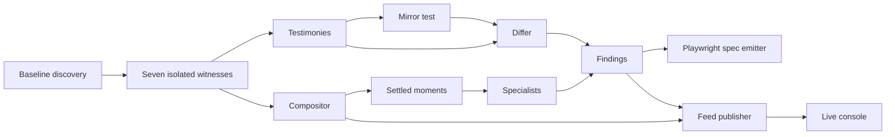

# Architecture

Parallax is a comparison pipeline. It discovers a bounded set of routes and visible controls from one baseline browser context, replays each surface in seven isolated contexts, then separates deterministic evidence from model-assisted visual review. The output is an append-only feed, mosaics for review, and generated regression specs.

## Context derivation

The baseline is an owner using English, light theme, and a desktop viewport. `derive_witnesses` creates two privilege variants, one Arabic locale variant, one dark-theme variant, and mobile and tablet viewport variants. Each derived witness changes one axis and preserves the rest.

This is deliberate rather than a 36-cell product. A full product combines privilege, locale, theme, and viewport changes, so a disagreement has multiple possible causes. One-axis derivation keeps the comparison small and makes the cause attributable: if the Arabic witness differs, locale is the only intentional change. It also keeps the wall to seven simultaneous sessions and leaves the relational sender/receiver pair as a separate, explicitly declared test.

The differ encodes two different expectations. On the privilege axis it looks for access that fails to narrow, including an anonymous or member witness reaching a surface that the owner reaches. On locale, theme, and viewport it looks for reachability drift. It records render defects independently, checks content signatures for theme and viewport divergence, and marks a surface dead only when no evidence-bearing witness reaches it.

## Isolated, concurrent witnesses

Every witness gets its own Playwright browser context with its own viewport, locale, color scheme, language header, and optional storage state. They share one Chromium browser process but never a browser context, page, cookies, or storage state.

The sessions run concurrently because simultaneity is part of the evidence. A sequential sweep can observe different live application states and can never show a sender change alongside a receiver that failed to observe it. Keeping seven private contexts open at once allows the compositor to align their visual state and enables the relational pair to act in one session while the other polls before a deadline. Concurrency also reduces elapsed time, but that is not its purpose here.

The sessions do not know who is watching. Witnesses navigate and evaluate the deterministic probe; the compositor receives JPEG frames through CDP and specialists only consume recorded moments and testimonies. No specialist controls a page or talks to another specialist. That separation prevents a reviewing lens from changing the behavior it is meant to judge.

## Relational scenario proposals

Relational scenarios are normally caller-declared data. `--propose-scenarios` is an opt-in discovery aid that asks Gemini 3.6 Flash on Vertex AI for up to three propagation or revocation scenarios after the baseline crawl. Its input is restricted to what the baseline observed: routes, affordances with labels and selectors, same-origin endpoints, visible text, and the roles supplied to the run. Without the flag, no proposal client is created and existing sweeps keep their behavior.

The model does not control a browser. Before a proposal reaches the ordinary data-only scenario validator, the proposer rejects references to routes, selectors, endpoints, or roles the baseline did not observe, rejects a sender and receiver that are the same role, and rejects fields outside the relational grammar. Each remaining proposal is then validated exactly as a file supplied to `--relational-scenarios` would be. The run summary preserves proposed and validated counts, every rejection and reason, model route, attempted and successful calls, and any error. That makes a rejected or unavailable proposal distinguishable from no useful proposal.

## Three capture layers

The first layer is the deterministic in-page probe. It measures horizontal overflow, offscreen controls, mobile tap targets, clipped text or controls, WCAG AA contrast, and untranslated strings. It also emits per-element geometry plus separate content and layout signatures. These checks are cheap, repeatable, and can produce a direct finding without image interpretation.

The second layer is cross-context comparison. The mirror test reflects Arabic geometry using `x' = W - x - w`, allowing translated text to change size while positions must mirror. For theme, geometry and the layout signature must remain unchanged. The differ then compares outcomes and signatures according to the varied axis.

Content signatures are a cheap screen, not the final content judgement. The FNV-1a signature identifies a changed region, while a matching signature never reaches a semantic model. For a changed landmark region, `text-embedding-005` on Vertex AI supplies embeddings whose cosine similarity is compared with the named `0.82` equivalence threshold; the resulting score travels with the finding as evidence. Theme and viewport use this comparison to distinguish ordinary copy variation from material content divergence.

Locale takes a second path. Cloud Translation v2 translates the baseline region into the variant locale before the same embedding comparison, because a faithful translation need not share its source words. This finds a meaning-changing Arabic string that raw i18n-key and Latin-text checks cannot see. The raw-text detector remains the deterministic fallback for obvious untranslated locale content.

The semantic path is globally bounded: it considers no more than twelve changed regions in a sweep and batches them into at most one Translation request and one Vertex embedding request. It therefore makes at most two paid semantic-model calls regardless of the number of surfaces. Its run report independently records attempted and successful calls, routes, and errors for each service. On an embedding failure, theme and viewport retain the content-signature finding with degraded evidence. A failed locale semantic comparison is likewise visible in the report; it only becomes a locale finding through the raw-text fallback when that detector has independent evidence.

The final layer is visual review. The layout and i18n specialist sends selected settled mosaics to Gemini, with a bounded number of moments, and accepts only structured reports tied to actual mosaic tiles. Vision comes last because it is more expensive and less repeatable than page geometry, and because the deterministic layers already answer measurable questions. The realtime specialist is deterministic and evaluates only explicitly relational testimony and moments.

## Mosaic and motion gate

Each witness starts a CDP screencast using JPEG quality 60. The compositor normalizes those frames into fixed tiles, maintains a four-by-two wall, and encodes the composed mosaic at JPEG quality 80 only when something needs to read it. It ignores stale frame sequence numbers and compares small grayscale thumbnails to detect motion.

A moment is emitted only after a changed tile has been quiet for the configured settle interval. Loading intermediates are not evidence, so the motion gate avoids spending model calls on half-painted frames. Moments are harvested while witnesses work and then written as mosaic events to the feed.

The mosaic is cheaper than seven separate screenshots because capture is already JPEG, tiles are scaled once into a shared wall, and composition is deferred until a reader needs it. It is also more accurate for the comparison task: all contexts are visible together in stable positions, so one outlying tile is apparent to a reviewer or model without reconstructing a cross-context join from independent images. Letterboxing preserves each viewport's proportions instead of stretching mobile into a desktop-shaped tile.

## Publication and regression artifacts

For every surface, the conductor writes status, mosaic, and finding events to `feed.jsonl`. Findings retain their exact testimony objects; feed payloads carry the summary, severity, axis, surface, evidence line, and witness names. The console renders this feed and uses tile geometry to highlight the witnesses supporting a finding.

The emitter turns each finding into a Playwright TypeScript spec configured with the selected witness viewport, locale, color scheme, and role storage-state convention. Authenticated specs accept role state only through `PARALLAX_<ROLE>_STORAGE_STATE`; they never embed the sweep's private path. The demo runner creates those states outside artifact trees with mode `0600` and removes them in `finally`. It emits reachability assertions for access findings and targeted assertions for known render and content findings.

Public evidence is copied through a closed manifest: `feed.jsonl`, generated `.spec.ts` files, and supported mosaic image types. The publisher opens every source without following symlinks, rejects non-regular or unexpected entries, and atomically replaces the public run. This keeps role cookies and unrelated local files outside `console/runs/` while preserving a live wall and concrete failing regression artifacts.
