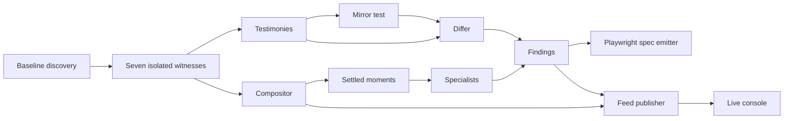

# Architecture

Parallax is a comparison pipeline. It discovers a bounded set of routes and visible controls from one baseline browser context, replays each surface in seven isolated contexts, then separates deterministic evidence from model-assisted visual review. The output is an append-only feed, mosaics for review, and generated regression specs.

## Context derivation

The baseline is an owner using English, light theme, and a desktop viewport. `derive_witnesses` creates two privilege variants, one Arabic locale variant, one dark-theme variant, and mobile and tablet viewport variants. Each derived witness changes one axis and preserves the rest.

This is deliberate rather than a 36-cell product. A full product combines privilege, locale, theme, and viewport changes, so a disagreement has multiple possible causes. One-axis derivation keeps the comparison small and makes the cause attributable: if the Arabic witness differs, locale is the only intentional change. It also keeps the wall to seven simultaneous sessions and leaves the relational sender/receiver pair as a separate, explicitly declared test.

The differ encodes two different expectations. On the privilege axis it looks for access that fails to narrow, including an anonymous or member witness reaching a surface that the owner reaches. On locale, theme, and viewport it looks for reachability drift. It records render defects independently, checks content signatures for theme and viewport divergence, and marks a surface dead only when no evidence-bearing witness reaches it.

## Isolated, concurrent witnesses

Every witness gets its own Playwright browser context with its own viewport, locale, color scheme, language header, and optional storage state. They share one Chromium browser process but never a browser context, page, cookies, or storage state.

The sessions run concurrently because simultaneity is part of the evidence. A sequential sweep can observe different live application states and can never show a sender change alongside a receiver that failed to observe it. Keeping seven private contexts open at once allows the compositor to align their visual state and enables the relational pair to act in one session while the other polls before a deadline. Concurrency also reduces elapsed time, but that is not its purpose here.

The sessions do not know who is watching. Witnesses navigate and evaluate the deterministic probe; the compositor receives JPEG frames through CDP and specialists only consume recorded moments and testimonies. No specialist controls a page or talks to another specialist. That separation prevents a reviewing lens from changing the behavior it is meant to judge.

## Three capture layers

The first layer is the deterministic in-page probe. It measures horizontal overflow, offscreen controls, mobile tap targets, clipped text or controls, WCAG AA contrast, and untranslated strings. It also emits per-element geometry plus separate content and layout signatures. These checks are cheap, repeatable, and can produce a direct finding without image interpretation.

The second layer is cross-context comparison. The mirror test reflects Arabic geometry using `x' = W - x - w`, allowing translated text to change size while positions must mirror. For theme, geometry and the layout signature must remain unchanged. The differ then compares outcomes and signatures according to the varied axis.

The final layer is visual review. The layout and i18n specialist sends selected settled mosaics to Gemini, with a bounded number of moments, and accepts only structured reports tied to actual mosaic tiles. Vision comes last because it is more expensive and less repeatable than page geometry, and because the deterministic layers already answer measurable questions. The realtime specialist is deterministic and evaluates only explicitly relational testimony and moments.

## Mosaic and motion gate

Each witness starts a CDP screencast using JPEG quality 60. The compositor normalizes those frames into fixed tiles, maintains a four-by-two wall, and encodes the composed mosaic at JPEG quality 80 only when something needs to read it. It ignores stale frame sequence numbers and compares small grayscale thumbnails to detect motion.

A moment is emitted only after a changed tile has been quiet for the configured settle interval. Loading intermediates are not evidence, so the motion gate avoids spending model calls on half-painted frames. Moments are harvested while witnesses work and then written as mosaic events to the feed.

The mosaic is cheaper than seven separate screenshots because capture is already JPEG, tiles are scaled once into a shared wall, and composition is deferred until a reader needs it. It is also more accurate for the comparison task: all contexts are visible together in stable positions, so one outlying tile is apparent to a reviewer or model without reconstructing a cross-context join from independent images. Letterboxing preserves each viewport's proportions instead of stretching mobile into a desktop-shaped tile.

## Publication and regression artifacts

For every surface, the conductor writes status, mosaic, and finding events to `feed.jsonl`. Findings retain their exact testimony objects; feed payloads carry the summary, severity, axis, surface, evidence line, and witness names. The console renders this feed and uses tile geometry to highlight the witnesses supporting a finding.

The emitter turns each finding into a self-contained Playwright TypeScript spec configured with the selected witness viewport, locale, color scheme, and role storage-state convention. It emits reachability assertions for access findings and targeted assertions for known render and content findings. This makes the result reviewable both as a live wall and as a concrete failing regression artifact.
